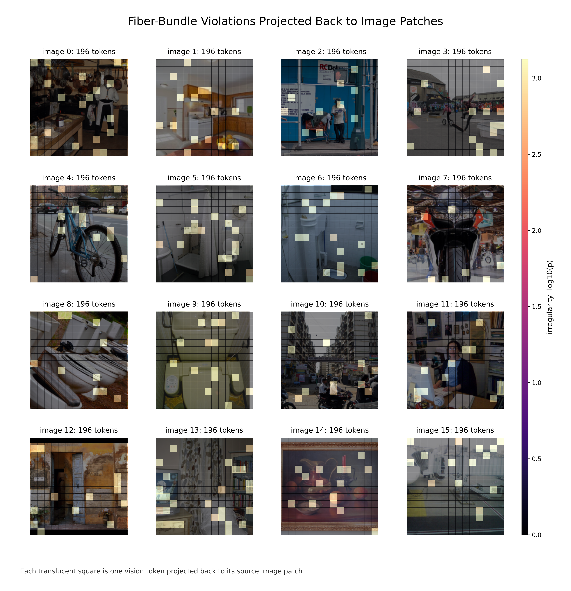
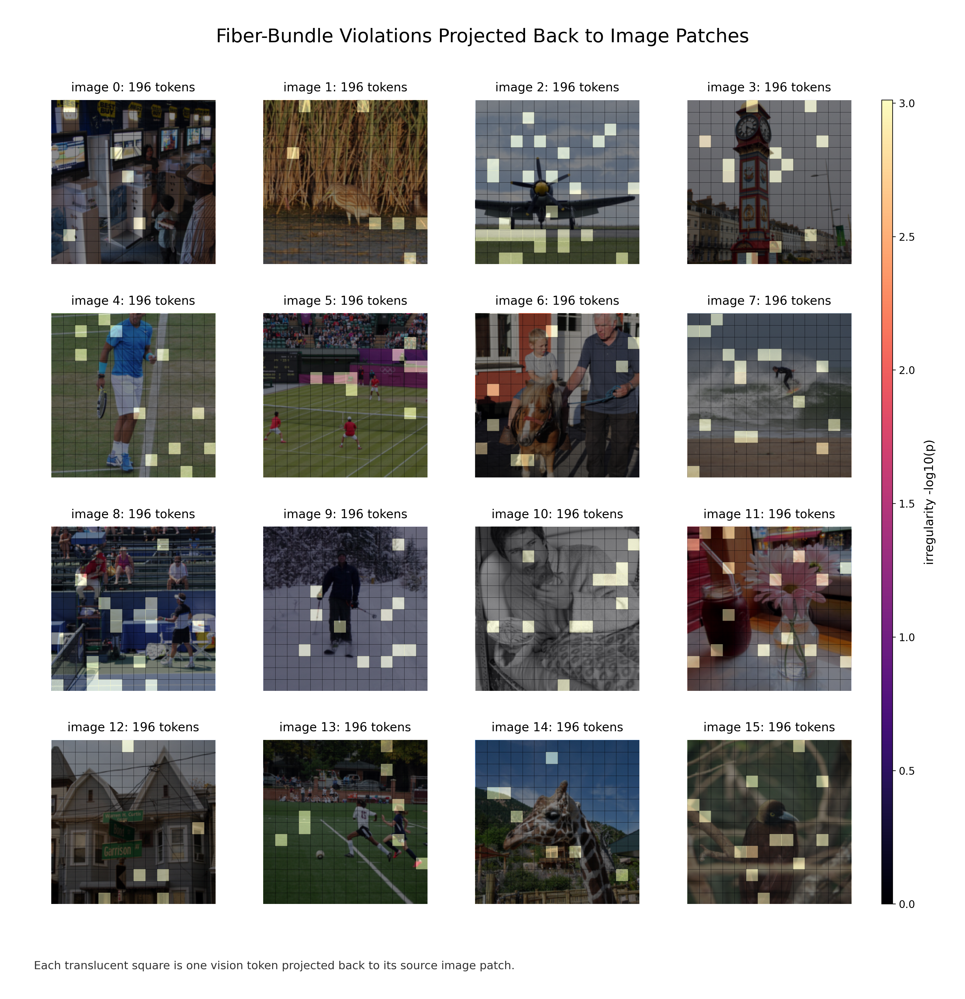
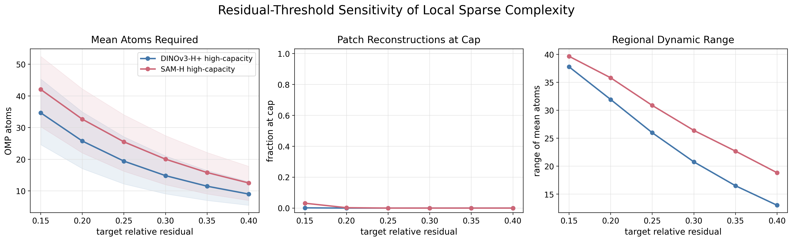
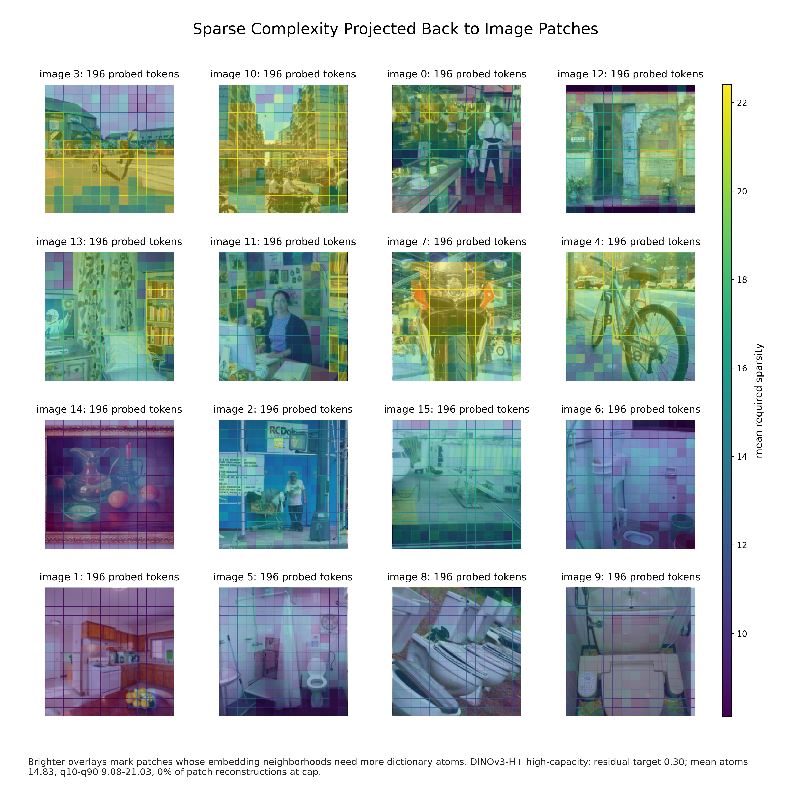
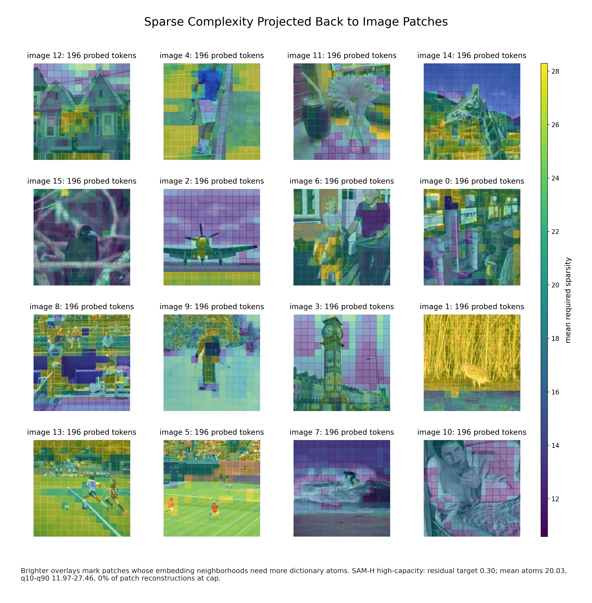
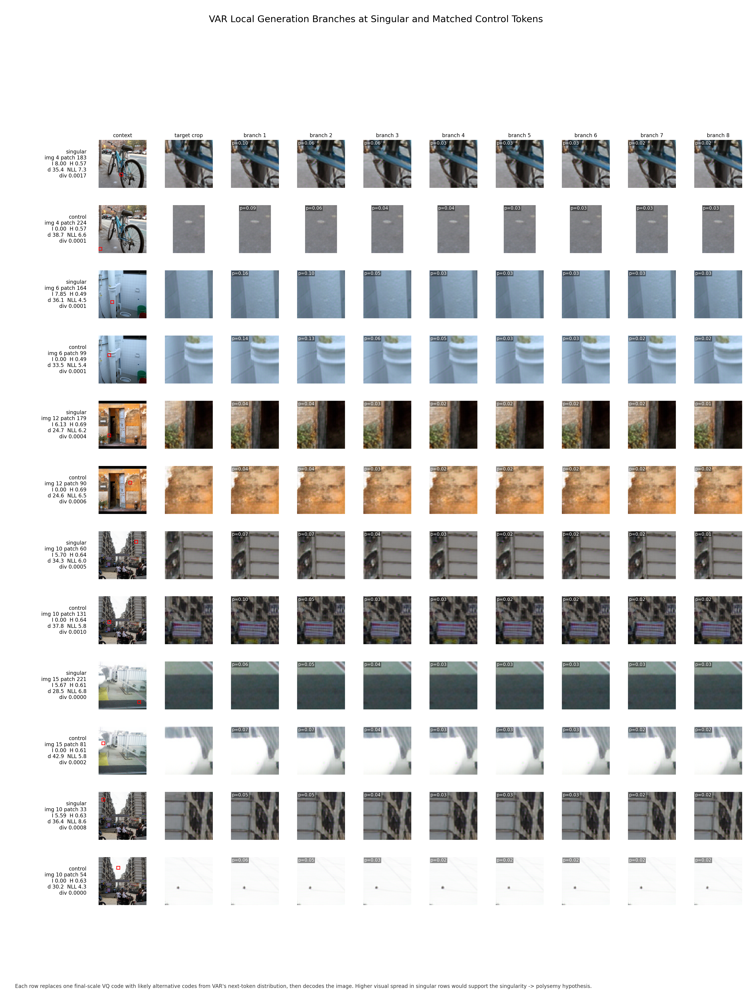

# Stratified Vision Representation Probes

This repository studies **local stratified geometry in dense vision representations**. The active experiments are no-training probes over frozen patch-token spaces from modern vision backbones, especially DINOv3, SAM, SigLIP2, AIMv2, and VAR. The goal is not to train another classifier; it is to measure where local neighborhoods behave like one smooth chart and where volume growth, corrected slope increases, or raw-patch sparse complexity reveal heterogeneous structure.

The current paper workspace lives in `docs/stratified-spaces/`. The current results index is `docs/RESULTS.md`, and the main run note is `docs/COCO_PRETRAINED_VIT_SAM_ANALYSIS.md`.

## Main Entry Points

- `src/train.py`: Hydra entrypoint for frozen encoder probes, local sparse dictionary probes, and legacy training-compatible configs.
- `src/training/sam_fiber_job.py`: SAM image-encoder and COCO box-prompt probe path.
- `src/volume_probe.py`: standalone no-training volume-scaling probe utilities.
- `scripts/var_generation_polysemy_probe.py`: VAR generation-side entropy/NLL probe.
- `scripts/var_generation_branch_samples.py`: matched branch-sampling follow-up for VAR anchors.
- `scripts/patch_token_distance_digest.py`: raw-patch versus token-distance agreement summaries.

## Recent Experiments And Results

The recent work moved from small scratch-backbone trials to **frozen, image-aligned dense vision representations**. The central question is now local and diagnostic: when a modern model maps image patches into token space, do nearby tokens behave like one smooth chart, or do local dimension, slope changes, image locality, and visible patch complexity separate?

All headline runs below are no-training probes. The model weights stay frozen; the pipeline collects patch tokens, builds nearest-neighbor neighborhoods in feature space, estimates local volume growth, tests for corrected fiber-bundle slope increases, and projects the results back onto image patches.

### 1. COCO Frozen-Encoder Suite

The main COCO suite uses 16 image-aligned examples for the paper-facing DINOv3-H+, SAM-H, SigLIP2-B, AIMv2-L, and VAR-d30 comparisons. DINOv3-L is retained as a scale comparison. Patch-size-16 encoders produce 14x14 token grids, while AIMv2 and VAR use 16x16 analysis grids.

| Model | Images | Tokens | Mean/med. dim | Change | Fiber viol. | Same-image | Mean sparse `S_i` |
|---|---:|---:|---:|---:|---:|---:|---:|
| DINOv3 ViT-L/16 | 21 | 4116 | 5.95 / 5.31 | 0.217 | 0.090 | 0.985 | 15.53 |
| DINOv3 ViT-H+/16 | 16 | 3136 | 6.61 / 5.98 | 0.200 | 0.076 | 0.979 | 14.83 |
| SAM ViT-Huge encoder | 16 | 3136 | 6.24 / 6.01 | 0.243 | 0.059 | 0.659 | 20.03 |
| SigLIP2-B | 16 | 3136 | 11.17 / 9.30 | 0.233 | 0.100 | 0.806 | 14.30 |
| AIMv2-L | 16 | 4096 | 12.30 / 10.29 | 0.217 | 0.102 | 0.746 | 12.64 |
| VAR-d30 | 16 | 4096 | 36.59 / 36.38 | 0.168 | 0.042 | 0.143 | 13.86 |

How to read the columns:

- `Mean/med. dim`: first-regime local dimension from log neighbor-count versus log radius.
- `Change`: any significant slope change in the local volume curve.
- `Fiber viol.`: corrected slope increases only, the forbidden direction under the fiber-bundle null.
- `Same-image`: mean fraction of `k=16` nearest neighbors from the same source image.
- `Mean sparse S_i`: average OMP atoms needed to reconstruct raw patches in a token neighborhood at `tau=0.30`.

The first result is that a single dimension number is too coarse. DINOv3-H+ and SAM-H have similar local dimensions, but DINOv3-H+ is far more image-local while SAM-H carries a larger raw-patch sparse reconstruction burden. SigLIP2-B and AIMv2-L occupy higher-dimensional local regimes and show the highest COCO fiber-violation ratios among the encoder runs. VAR-d30 is deliberately different: as an autoregressive visual-token state, it is very high-dimensional and much less image-local.

| DINOv3-H+ fiber violations | SAM-H fiber violations |
|---|---|
|  |  |

These heatmaps are not saliency maps. Each square is a patch token, and brightness marks corrected evidence that the local volume curve becomes steeper at a larger radius. DINOv3-H+ looks more spatially coherent, matching its very high same-image neighbor rate. SAM-H mixes across images earlier, but its irregular regions often align with object boundaries, foreground/background structure, or segmentation-relevant transitions.

### 2. Sparse Raw-Patch Complexity

The sparse probe asks a separate question: if a token's feature-space neighborhood is collected, are the corresponding raw image patches easy to summarize with a small local dictionary? Each token gets its own local PCA dictionary, and OMP counts how many atoms are needed to reach a residual target.

The high-capacity setting uses fixed `k=128` neighborhoods, 128 local PCA atoms, OMP cap 64, and `tau=0.30` for the main heatmaps. At this setting, SAM-H needs more atoms on average than DINOv3-H+ even though their median local dimensions are similar:

| Model | Mean atoms at `tau=0.30` | 10-90% range | Patch cap rate |
|---|---:|---:|---:|
| DINOv3-H+ | 14.83 | 9.08-21.03 | 0.0% |
| SAM-H | 20.03 | 11.97-27.46 | 0.0% |

SigLIP2-B and AIMv2-L use the same fixed-`k=128`, 128-atom, cap-64 protocol in the vision-expansion sweep. At `tau=0.30`, SigLIP2-B requires 14.30 atoms on average and AIMv2-L requires 12.64, even though both have higher local dimension and higher fiber-violation ratios than DINOv3-H+ and SAM-H.

| Residual-threshold sweep | DINOv3-H+ sparse heatmap | SAM-H sparse heatmap |
|---|---|---|
|  |  |  |

This is the key interpretability move: high local dimension means fast neighbor growth in feature space; high sparse complexity means the corresponding raw visual neighborhood is hard to reconstruct with few local atoms. They can line up, but the experiments show they are not the same signal.

### 3. Patch Geometry Versus Token Geometry

Same-image locality says whether neighbors come from the same image, but it does not say whether token distances preserve raw RGB patch distances inside that image. The patch-token distance diagnostic compares each image's raw-patch distance matrix to the learned token-distance matrix.

| Model | Distance-rank corr. | Top-16 overlap | Matrix rank corr. |
|---|---:|---:|---:|
| DINOv3-H+ | 0.299 | 0.279 | 0.304 |
| SAM-H | 0.565 | 0.381 | 0.591 |
| SigLIP2-B | 0.136 | 0.168 | 0.146 |
| AIMv2-L | 0.099 | 0.119 | 0.095 |


SAM-H preserves more within-image raw-patch geometry than DINOv3-H+. SigLIP2-B and AIMv2-L are more strongly reorganized away from raw RGB patch distances. That is not a quality ranking; it means their feature metrics are using invariances, context, or semantics that raw pixel distance does not capture.

### 4. Extra Encoders: SigLIP2-B And AIMv2-L

SigLIP2-B and AIMv2-L extend the story beyond the DINOv3/SAM contrast. Both remain strongly image-local, but both sit in higher-dimensional regimes and have fiber-violation ratios around 0.10 on COCO. Their sparse complexity is not proportionally higher, which is another sign that local dimension and raw-patch dictionary burden are separate axes.

| SigLIP2-B fiber violations | AIMv2-L fiber violations |
|---|---|
|  |  |

### 5. Cross-Dataset Stress Tests

The same frozen-encoder pipeline was repeated on STL10, DTD, and EuroSAT. This checks whether the diagnostic is just a COCO story or whether domain shift changes the local geometry.

| Dataset | Model | Tokens | Mean/med. dim | Change | Fiber viol. | Same-image | Mean `S_i` |
|---|---|---:|---:|---:|---:|---:|---:|
| STL10 | DINOv3-H+ | 3136 | 6.44 / 5.73 | 0.203 | 0.069 | 0.994 | 11.03 |
| STL10 | SAM-H | 3136 | 5.46 / 4.89 | 0.278 | 0.090 | 0.704 | 13.50 |
| STL10 | SigLIP2-B | 3136 | 7.94 / 6.49 | 0.207 | 0.081 | 0.834 | 10.05 |
| STL10 | AIMv2-L | 4096 | 9.00 / 7.86 | 0.211 | 0.086 | 0.739 | 7.59 |
| DTD | DINOv3-H+ | 3136 | 6.39 / 6.09 | 0.169 | 0.067 | 0.858 | 6.29 |
| DTD | SAM-H | 3136 | 6.09 / 5.75 | 0.235 | 0.037 | 0.829 | 22.92 |
| DTD | SigLIP2-B | 3136 | 9.21 / 8.59 | 0.179 | 0.074 | 0.732 | 7.24 |
| DTD | AIMv2-L | 4096 | 9.58 / 9.15 | 0.186 | 0.069 | 0.620 | 6.55 |
| EuroSAT | DINOv3-H+ | 3136 | 8.45 / 7.55 | 0.173 | 0.053 | 0.974 | 16.17 |
| EuroSAT | SAM-H | 3136 | 4.03 / 3.00 | 0.425 | 0.172 | 0.841 | 27.85 |
| EuroSAT | SigLIP2-B | 3136 | 10.87 / 10.26 | 0.175 | 0.058 | 0.414 | 4.94 |
| EuroSAT | AIMv2-L | 4096 | 12.55 / 11.75 | 0.171 | 0.056 | 0.327 | 3.49 |

The strongest stress case is SAM-H on EuroSAT: low median local dimension, high change rate, high corrected fiber-violation ratio, and the largest sparse reconstruction burden. DTD shows a different split: texture neighborhoods are sparse-simple for DINOv3, SigLIP2, and AIMv2, but not for SAM.


### 6. VAR Generation-Side Control

VAR-d30 is not treated as a matched encoder. It is an autoregressive generator state, so it gives a different test: does geometric irregularity predict generation ambiguity?

The answer so far is mostly no. Corrected fiber irregularity is nearly uncorrelated with normalized entropy and observed-token NLL in the current COCO slice. Estimated dimension has a stronger relationship to generation uncertainty. The matched branch-sampling probe is also a useful negative control: high-entropy branch alternatives mostly produce texture and color shifts rather than clean semantic alternatives.



### Takeaway

The recent experiments make the project less about one backbone and more about a measurement suite:

- Local dimension, corrected fiber violations, image locality, sparse raw-patch complexity, and patch-token distance agreement measure different things.
- DINOv3-H+ is highly image-local and spatially coherent.
- SAM-H is less image-local, but its geometry is strongly tied to segmentation-style image structure and can be stressed hard by satellite imagery.
- SigLIP2-B and AIMv2-L occupy higher-dimensional regimes while keeping sparse complexity moderate.
- VAR-d30 shows that generation uncertainty is not automatically explained by fiber violations.

## Installation

Install PyTorch and torchvision for your CUDA build first, then install the local dependencies:

```bash
pip install torch torchvision
pip install -r requirements-local.txt
```

Optional W&B logging:

```bash
wandb login
```

## Data Layout

Hydra configs default to `../data`, which matches a checkout beside a shared data directory:

```text
Projects/
  data/
    coco/
    dtd/
    eurosat/
    stl10_binary/
  llm-stratified/
```

Override once per shell if your datasets live elsewhere:

```bash
export LLM_STRATIFIED_DATA_ROOT=/path/to/data
export LLM_STRATIFIED_OUTPUT_ROOT=/scratch/$USER/runs/llm-stratified
```

PowerShell:

```powershell
$env:LLM_STRATIFIED_DATA_ROOT = "../data"
$env:LLM_STRATIFIED_OUTPUT_ROOT = "runs"
```

COCO is not auto-downloaded. The expected layout is:

```text
<data.root>/coco/
  train2017/
  val2017/
  annotations/instances_train2017.json
  annotations/instances_val2017.json
```

Use the helper to download or verify COCO 2017:

```bash
scripts/setup_coco2017.sh /scratch/$USER/data
scripts/setup_coco2017.sh --verify-only /scratch/$USER/data
```

## Quick Checks

Run a no-download sanity check:

```bash
python src/train.py +experiment=quick_test
```

Local wrapper, with W&B disabled by default:

```powershell
.\scripts\run_local.ps1 -Experiment quick_test
```

```bash
scripts/run_local.sh
```

## Current COCO Probes

The current paper runs use frozen representations and `training.epochs=0`. Each selected image contributes a complete patch-token grid so local dimension, fiber violations, sparse raw-patch complexity, and image-space heatmaps stay aligned.

```bash
# DINOv3-H+ frozen patch-token probe
python src/train.py +experiment=coco_dinov3_huge_sparse_fiber data.root=/scratch/$USER/data

# SAM-H image-encoder probe with COCO box-prompt mask previews
python src/train.py +experiment=coco_sam_fiber data.root=/scratch/$USER/data

# SigLIP2-B multimodal encoder probe
python src/train.py +experiment=coco_siglip2_base_sparse_fiber data.root=/scratch/$USER/data

# AIMv2-L vision encoder probe
python src/train.py +experiment=coco_aimv2_large_sparse_fiber data.root=/scratch/$USER/data

# VAR-d30 autoregressive visual-token probe
python src/train.py +experiment=coco_var_d30_sparse_fiber data.root=/scratch/$USER/data
```

For COCO debug and paper-facing runs, `data.num_workers=0` is the safest default in this repo because the dataset wrapper keeps a large annotation object in memory.

## Cross-Dataset Stress Tests

The paper also probes DINOv3-H+, SAM-H, SigLIP2-B, and AIMv2-L on STL10, DTD, and EuroSAT. The helper script records those run families and summary tables:

```powershell
.\scripts\run_cross_dataset_vision.ps1
```

Outputs are collected under `runs/local/<dataset>_<model>_sparse_fiber/` and summarized in `runs/local/cross_dataset_logs/`.

## VAR Generation-Side Probes

VAR is treated as a generation-token control rather than as a matched image encoder. The generation-side probes align final-scale tokens with entropy, observed-code NLL, and branch samples:

```bash
python scripts/var_generation_polysemy_probe.py --help
python scripts/var_generation_branch_samples.py --help
python scripts/var_generation_aggregate_from_json.py --help
```

These are documented in `docs/COCO_PRETRAINED_VIT_SAM_ANALYSIS.md` and integrated into the paper appendix.

## Outputs

Hydra writes runs under `${LLM_STRATIFIED_OUTPUT_ROOT:-runs}/hydra/...` unless an experiment or wrapper sets `hydra.run.dir`. Local paper runs usually live under `runs/local/<experiment>/<timestamp>/`.

Important outputs include:

- `checkpoints/fiber_analysis/`: local dimension maps, irregularity heatmaps, patch galleries, and volume-curve galleries.
- `checkpoints/fiber_history.json`: per-run fiber-bundle summaries.
- `checkpoints/sparse_probe_summary.json`: fixed-neighborhood local dictionary summaries when sparse probes are enabled.
- `token_processing_notes.md`: token collection details for SAM and frozen-token runs.
- `docs/imgs/neurips_submission/`: vendored paper figures.

## Documentation Map

- `docs/RESULTS.md`: short index of current result artifacts.
- `docs/COCO_PRETRAINED_VIT_SAM_ANALYSIS.md`: run ledger and interpretation notes for the current frozen COCO probes.
- `docs/stratified-spaces/main.tex`: anonymous paper source.
- `docs/stratified-spaces/draft.tex`: preprint-style draft.
- `docs/stratified-spaces/README.md`: paper bundle guide and build notes.
- `docs/stratified-spaces/framing.md`: conceptual framing for the stratified-space interpretation.

The older scratch-backbone trial reports have been removed from the active narrative. Superseded volume-probe report files now only point to the current paper artifacts.

## Tests

Unit tests avoid dataset downloads and run on CPU:

```bash
python -m unittest discover -s tests
```

## Repo Layout

```text
.
|-- configs/                   # Hydra config groups and experiment presets
|-- docs/                      # paper notes, figure assets, current result index
|-- scripts/                   # launchers and post-processing utilities
|-- src/                       # training/probe entrypoints and core modules
|-- tests/                     # CPU-friendly unit tests
`-- runs/                      # local outputs, checkpoints, plots
```
